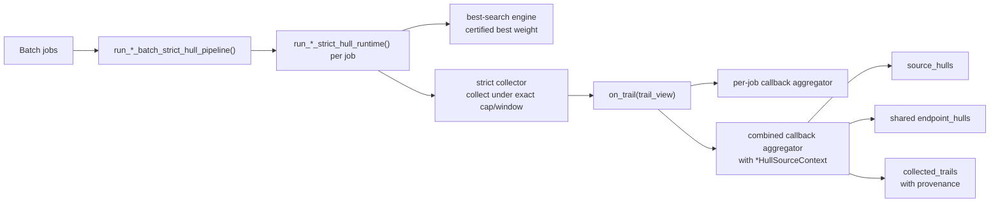
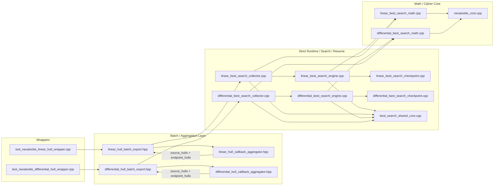

# NeoAlzette 自动搜索框架：差分与线性链路说明（审稿人版）

文档面向**已熟悉 C++ 与分组密码差分/线性分析基本概念**的读者，说明本仓库中 `auto_search_frame` 拆分后的模块协作方式、数学对象与实现的对应关系、checkpoint 对 DFS 的恢复语义，以及 **w-pDDT / z-shell based Weight-Sliced cLAT** 的定位与严格性。

---

## 0. 论文承袭与方法来源

该工程并非仅借用 `pDDT` / `cLAT` 术语，也并非仅将论文中的 lookup 表移入代码；其实现直接承袭相关论文中的**数学对象、搜索伪码结构、以及中间轮候选生成方式**。

- **差分侧**：承袭 Biryukov-Velichkov 的 **pDDT / threshold-search / Matsui branch-and-bound** 路线。原始 pDDT 的定义是  
  `DP(alpha,beta->gamma) >= p_thres`；  
  本项目保留这条搜索思想，但把 threshold 轴严格化成**精确整数权重 shell**：
  `S_t(alpha,beta) = { gamma | w_diff(alpha,beta->gamma) = t }`。  
  因而代码中的 **`Weight-Sliced pDDT (w-pDDT)`** 对应 pDDT 语义在 exact weight-shell 方向上的实现形式。
- **线性侧**：承袭 **Schulte-Geers** 的显式相关公式，以及 Huang/Wang 2019 那篇关于 **specific correlation weight space + cLAT + split-lookup-recombine** 的路线。数学上，权重轴就是  
  `z = M^T(u xor v xor w)` 的 `wt(z)`；  
  工程上，再用 split/lookup/recombine 来枚举未知 masks。故本项目里 **`Weight-Sliced cLAT`** 的准确理解是：**数学对象是 z-shell，cLAT 是工程承袭**。
- 因此，`auto_search_frame` 的模块拆分、显式栈 DFS、以及 checkpoint-resume 搜索骨架，均对应论文中的**首轮低权展开 / 中间轮 lookup + recombine / Matsui 式剪枝**，并经适配后形成 NeoAlzette 的工程实现。

---

## 1. 文件组织与职责映射

实现按**职责**拆分为多文件结构，可按模块层级而非文件名字母顺序阅读：

| 层级 | 差分（Differential） | 线性（Linear） | 共用 |
|------|----------------------|----------------|------|
| **类型与上下文** | `include/auto_search_frame/detail/differential_best_search_types.hpp` | `include/auto_search_frame/detail/linear_best_search_types.hpp` | — |
| **原语 / 枚举器状态** | `detail/differential_best_search_primitives.hpp` | `detail/linear_best_search_primitives.hpp` | — |
| **数学：权重、注入、模加/减 const、加速器** | `detail/differential_best_search_math.hpp` + `src/.../differential_best_search_math.cpp` | `detail/linear_best_search_math.hpp` + `src/.../linear_best_search_math.cpp` | — |
| **搜索引擎（显式栈 DFS + Matsui 式剪枝）** | `src/auto_search_frame/differential_best_search_engine.cpp` | `src/auto_search_frame/linear_best_search_engine.cpp` | `detail/best_search_shared_core.hpp` + `best_search_shared_core.cpp`（checkpoint 轮询/收尾策略） |
| **收集器 / Hull** | 实现：`differential_best_search_collector.cpp` | 实现：`linear_best_search_collector.cpp` | 对外入口声明仍放在 `detail/*_best_search_types.hpp`；回调聚合辅助在 `differential_hull_callback_aggregator.hpp` / `linear_hull_callback_aggregator.hpp` |
| **二进制 checkpoint 序列化** | `detail/differential_best_search_checkpoint.hpp` + `differential_best_search_checkpoint.cpp` | `detail/linear_best_search_checkpoint.hpp` + `linear_best_search_checkpoint.cpp` | `search_checkpoint.hpp`（魔数、版本、endian 标记） |
| **密码学“地面真值”一轮** | — | — | `include/neoalzette/neoalzette_core.hpp`、`src/neoalzette/neoalzette_core.cpp` |

**测试入口（高层入口封装）**仍可能在 `include/auto_search_frame/test_neoalzette_*_best_search.hpp` 与各 `test_neoalzette_*.cpp` 中；引擎与数学核心已下沉到 `src/auto_search_frame/`。

### 1.1 仓库里的真实目录树（只列与本架构直接相关的源码）

下面这棵树对应的是“源代码真身”，不是构建产物。`.vs/`、`build*/`、`out/`、`papers/`、`papers_txt/`、`MyNewPaper/` 虽然也在仓库里，但不属于 `auto_search_frame` 主执行链路的源码主体。

```text
.
├─ CMakeLists.txt
├─ common/
│  ├─ runtime_component.hpp
│  └─ runtime_component.cpp
├─ include/
│  ├─ neoalzette/
│  │  └─ neoalzette_core.hpp
│  ├─ arx_analysis_operators/
│  │  ├─ README.md
│  │  ├─ differential_xdp_add.hpp
│  │  ├─ differential_optimal_gamma.hpp
│  │  ├─ differential_addconst.hpp
│  │  ├─ linear_correlation_add_logn.hpp
│  │  ├─ linear_correlation_addconst.hpp
│  │  ├─ linear_correlation_addconst_flat.hpp
│  │  └─ modular_addition_ccz.hpp
│  └─ auto_search_frame/
│     ├─ differential_batch_breadth_deep.hpp
│     ├─ differential_hull_batch_export.hpp
│     ├─ differential_hull_callback_aggregator.hpp
│     ├─ hull_growth_common.hpp
│     ├─ linear_batch_breadth_deep.hpp
│     ├─ linear_hull_batch_export.hpp
│     ├─ linear_hull_callback_aggregator.hpp
│     ├─ search_checkpoint.hpp
│     ├─ test_neoalzette_differential_best_search.hpp
│     ├─ test_neoalzette_linear_best_search.hpp
│     └─ detail/
│        ├─ auto_pipeline_shared.hpp
│        ├─ best_search_shared_core.hpp
│        ├─ differential_best_search_checkpoint.hpp
│        ├─ differential_best_search_checkpoint_state.hpp
│        ├─ differential_best_search_math.hpp
│        ├─ differential_best_search_primitives.hpp
│        ├─ differential_best_search_types.hpp
│        ├─ linear_best_search_checkpoint.hpp
│        ├─ linear_best_search_checkpoint_state.hpp
│        ├─ linear_best_search_math.hpp
│        ├─ linear_best_search_primitives.hpp
│        └─ linear_best_search_types.hpp
├─ src/
│  ├─ neoalzette/
│  │  └─ neoalzette_core.cpp
│  └─ auto_search_frame/
│     ├─ best_search_shared_core.cpp
│     ├─ differential_best_search_checkpoint.cpp
│     ├─ differential_best_search_collector.cpp
│     ├─ differential_best_search_engine.cpp
│     ├─ differential_best_search_math.cpp
│     ├─ linear_best_search_checkpoint.cpp
│     ├─ linear_best_search_collector.cpp
│     ├─ linear_best_search_engine.cpp
│     └─ linear_best_search_math.cpp
├─ test_arx_operator_self_test.cpp
├─ test_neoalzette_arx_trace.cpp
├─ test_neoalzette_differential_best_search.cpp
├─ test_neoalzette_linear_best_search.cpp
├─ test_neoalzette_differential_hull_wrapper.cpp
├─ test_neoalzette_linear_hull_wrapper.cpp
├─ pnb_distinguisher/
│  ├─ test_neoalzette_arx_probabilistic_neutral_bits.cpp
│  └─ test_neoalzette_arx_probabilistic_neutral_bits_average.cpp
└─ ...
```

### 1.2 文件夹 / 文件 到 架构层的逐项对应

| 路径 | 在架构里的角色 | 关键文件 |
|------|----------------|----------|
| `common/` | CLI 运行时公共设施：内存门控、线程监控、日志辅助 | `runtime_component.hpp/.cpp` |
| `include/neoalzette/` + `src/neoalzette/` | 密码核心真值实现 | `neoalzette_core.hpp/.cpp` |
| `include/arx_analysis_operators/` | header-only ARX 数学算子库 | `differential_xdp_add.hpp`、`linear_correlation_addconst.hpp` 等 |
| `include/auto_search_frame/` | 对外 facade、batch/hull 导出、wrapper 共享接口 | `*_hull_batch_export.hpp`、`*_callback_aggregator.hpp`、`test_neoalzette_*_best_search.hpp` |
| `include/auto_search_frame/detail/` | 内部数据结构、checkpoint 状态、数学声明、枚举器原语 | `*_types.hpp`、`*_primitives.hpp`、`*_math.hpp`、`*_checkpoint*.hpp` |
| `src/auto_search_frame/` | 内部实现：shared core / math / engine / collector / checkpoint | `best_search_shared_core.cpp`、`*_best_search_*.cpp` |
| 顶层 `test_neoalzette_*_best_search.cpp` | 位于顶层源文件目录的差分 / 线性 best-search CLI 入口 | 两个 `*_best_search.cpp` |
| 顶层 `test_neoalzette_*_hull_wrapper.cpp` | strict hull batch wrapper CLI | 两个 `*_hull_wrapper.cpp` |
| 顶层 `test_neoalzette_arx_trace.cpp` | trace / instrumentation 入口 | `test_neoalzette_arx_trace.cpp` |
| 顶层 `test_arx_operator_self_test.cpp` | 被 best-search CLI 复用的自测源，不是独立 target | `run_arx_operator_self_test()` |
| `papers/`、`papers_txt/`、`MyNewPaper/` | 论文、实验素材、写作资产 | 不属于运行时主架构 |
| `.vs/`、`build*/`、`out/` | IDE / CMake / 构建产物目录 | 不属于源码层 |

### 1.3 从 `CMakeLists.txt` 反推：每个 target 到底编了哪些文件

| CMake target | 入口文件 | 主要源码组成 | 作用 |
|-------------|----------|--------------|------|
| `neoalzette` | — | `src/neoalzette/neoalzette_core.cpp` | 密码核心静态库 |
| `test_neoalzette_arx_trace` | `test_neoalzette_arx_trace.cpp` | `neoalzette` | 差分 trace / 调试 |
| `test_neoalzette_differential_best_search` | `test_neoalzette_differential_best_search.cpp` | `test_arx_operator_self_test.cpp`、`common/runtime_component.cpp`、`src/auto_search_frame/best_search_shared_core.cpp`、`src/auto_search_frame/differential_best_search_math.cpp`、`src/auto_search_frame/differential_best_search_checkpoint.cpp`、`src/auto_search_frame/differential_best_search_engine.cpp`、`src/auto_search_frame/differential_best_search_collector.cpp`，以及当前 CMake 里额外编入的 `src/auto_search_frame/linear_best_search_math.cpp` | 差分 best-search CLI |
| `test_neoalzette_linear_best_search` | `test_neoalzette_linear_best_search.cpp` | `test_arx_operator_self_test.cpp`、`common/runtime_component.cpp`、`src/auto_search_frame/best_search_shared_core.cpp`、`src/auto_search_frame/linear_best_search_math.cpp`、`src/auto_search_frame/linear_best_search_checkpoint.cpp`、`src/auto_search_frame/linear_best_search_engine.cpp`、`src/auto_search_frame/linear_best_search_collector.cpp`，以及当前 CMake 里额外编入的 `src/auto_search_frame/differential_best_search_math.cpp` | 线性 best-search CLI |
| `test_neoalzette_differential_hull_wrapper` | `test_neoalzette_differential_hull_wrapper.cpp` | `common/runtime_component.cpp` + 全套 differential `src/auto_search_frame/*.cpp` + `best_search_shared_core.cpp` | 差分 strict hull wrapper |
| `test_neoalzette_linear_hull_wrapper` | `test_neoalzette_linear_hull_wrapper.cpp` | `common/runtime_component.cpp` + 全套 linear `src/auto_search_frame/*.cpp` + `best_search_shared_core.cpp` | 线性 strict hull wrapper |
| `pnb_distinguisher/test_neoalzette_arx_probabilistic_neutral_bits` | `pnb_distinguisher/test_neoalzette_arx_probabilistic_neutral_bits.cpp` | `neoalzette_core`（子工程） | PNB 风格独立实验程序 |
| `pnb_distinguisher/test_neoalzette_arx_probabilistic_neutral_bits_average` | `pnb_distinguisher/test_neoalzette_arx_probabilistic_neutral_bits_average.cpp` | `neoalzette_core`（子工程） | 平均 PNB 独立实验程序 |

该表用于将图中的抽象模块名映射到 `CMakeLists.txt` 中的**入口文件**和**实现文件集合**。

### 1.4 更细的 Mermaid：从仓库根目录到可执行链路

下面这张图不再只画“模块层”，而是把**根目录、关键文件夹、关键入口文件、以及主要 `.cpp/.hpp` 实体**一起画出来。

```mermaid
flowchart TB
    ROOT["repo root"]
    AUX["papers/ + MyNewPaper/ + build*/ + out/\n(non-runtime source folders or generated artifacts)"]

    ROOT --> CMAKE["CMakeLists.txt"]
    ROOT --> COMMON["common/runtime_component.*"]
    ROOT --> CORE_H["include/neoalzette/neoalzette_core.hpp"]
    ROOT --> OPS["include/arx_analysis_operators/*.hpp"]
    ROOT --> ASF_PUB["include/auto_search_frame/*.hpp"]
    ROOT --> ASF_DETAIL["include/auto_search_frame/detail/*.hpp"]
    ROOT --> CORE_CPP["src/neoalzette/neoalzette_core.cpp"]
    ROOT --> AUTO_SRC["src/auto_search_frame/*.cpp"]
    ROOT --> AUX

    CMAKE --> LIB["target: neoalzette"]
    CMAKE --> TRACE_T["target: test_neoalzette_arx_trace"]
    CMAKE --> DCLI_T["target: test_neoalzette_differential_best_search"]
    CMAKE --> LCLI_T["target: test_neoalzette_linear_best_search"]
    CMAKE --> DHULL_T["target: test_neoalzette_differential_hull_wrapper"]
    CMAKE --> LHULL_T["target: test_neoalzette_linear_hull_wrapper"]

    LIB --> CORE_CPP
    CORE_CPP --> CORE_H

    TRACE_T --> TRACE_MAIN["test_neoalzette_arx_trace.cpp"]
    TRACE_MAIN --> CORE_H

    DCLI_T --> DCLI_MAIN["test_neoalzette_differential_best_search.cpp"]
    DCLI_T --> SELFTEST["test_arx_operator_self_test.cpp"]
    DCLI_T --> COMMON
    DCLI_T --> D_SHARED["src/auto_search_frame/best_search_shared_core.cpp"]
    DCLI_T --> D_MATH["src/auto_search_frame/differential_best_search_math.cpp"]
    DCLI_T --> D_CKPT["src/auto_search_frame/differential_best_search_checkpoint.cpp"]
    DCLI_T --> D_ENGINE["src/auto_search_frame/differential_best_search_engine.cpp"]
    DCLI_T --> D_COLLECT["src/auto_search_frame/differential_best_search_collector.cpp"]
    DCLI_T --> D_API["include/auto_search_frame/test_neoalzette_differential_best_search.hpp"]

    LCLI_T --> LCLI_MAIN["test_neoalzette_linear_best_search.cpp"]
    LCLI_T --> SELFTEST
    LCLI_T --> COMMON
    LCLI_T --> L_SHARED["src/auto_search_frame/best_search_shared_core.cpp"]
    LCLI_T --> L_MATH["src/auto_search_frame/linear_best_search_math.cpp"]
    LCLI_T --> L_CKPT["src/auto_search_frame/linear_best_search_checkpoint.cpp"]
    LCLI_T --> L_ENGINE["src/auto_search_frame/linear_best_search_engine.cpp"]
    LCLI_T --> L_COLLECT["src/auto_search_frame/linear_best_search_collector.cpp"]
    LCLI_T --> L_API["include/auto_search_frame/test_neoalzette_linear_best_search.hpp"]

    DHULL_T --> DHULL_MAIN["test_neoalzette_differential_hull_wrapper.cpp"]
    DHULL_T --> COMMON
    DHULL_T --> D_ENGINE
    DHULL_T --> D_COLLECT
    DHULL_T --> D_API
    DHULL_T --> D_BATCH["include/auto_search_frame/differential_hull_batch_export.hpp"]
    DHULL_T --> D_AGG["include/auto_search_frame/differential_hull_callback_aggregator.hpp"]

    LHULL_T --> LHULL_MAIN["test_neoalzette_linear_hull_wrapper.cpp"]
    LHULL_T --> COMMON
    LHULL_T --> L_ENGINE
    LHULL_T --> L_COLLECT
    LHULL_T --> L_API
    LHULL_T --> L_BATCH["include/auto_search_frame/linear_hull_batch_export.hpp"]
    LHULL_T --> L_AGG["include/auto_search_frame/linear_hull_callback_aggregator.hpp"]

    D_API --> D_DETAIL["include/auto_search_frame/detail/differential_*.hpp"]
    L_API --> L_DETAIL["include/auto_search_frame/detail/linear_*.hpp"]
    D_ENGINE --> CORE_H
    D_COLLECT --> CORE_H
    L_ENGINE --> CORE_H
    L_COLLECT --> CORE_H
    D_MATH --> OPS
    L_MATH --> OPS
```



---

## 2. 差分搜索：函数链路怎么走

### 2.1 数学对象

- 在 **XOR 差分**模型下，每一轮在分支上携带的是 32 位差分 \(\Delta A,\Delta B\)（代码里 `std::uint32_t`）。
- **ARX 非线性**主要来自 **模 \(2^{32}\) 加法**的差分传播；权重采用标准 **\(-\log_2\) 概率权重**（与 LM2001 的 `xdp_add` 模型一致，见 `arx_analysis_operators/differential_xdp_add.hpp` 等）。
- **与常数的模加/模减**有专用 **精确**权重（主路径统一使用 `diff_subconst_exact_weight_ceil_int` 这类 exact 命名接口，不再保留会与近似 BvWeight 混淆的旧别名）。
- **注入层**（`cd_injection_from_B` / `cd_injection_from_A`）在差分下用 **仿射子空间**刻画输出差分集合：`InjectionAffineTransition{ offset, basis_vectors, rank_weight }`，其中 `rank_weight` 对应均匀随机输入下该差分出现的 \(\log_2\) 概率损失（见 `differential_best_search_math.hpp` 顶部注释）。
- 搜索方向为 **正向**（从输入差分向输出差分）

### 2.2 代码中的“一轮”与遍历顺序

类 **`DifferentialBestTrailSearcherCursor`**（在 `differential_best_search_engine.cpp` 内）实现 **显式栈 DFS**，阶段枚举为 `DifferentialSearchStage`（`Enter` → 第一次模加 → 第一次 subconst → 注入 B → 第二次模加 → …）。**遍历顺序是 DFS，但剪枝界是全局当前最优**（见下节「DFS 与 B&B」），与 ARX 自动搜索经典写法（Speck 一文等）一致。

当前阶段拆分与首轮/中间轮的工程组织，并非仅沿用 `pDDT` 名称，而是将差分论文中的 **threshold-search + Matsui B&B** 骨架落实到 NeoAlzette 的单轮子步骤；原论文中的 threshold pDDT 在此被替换为精确 **weight-shell** 版本。

每一层栈帧保存：

- 当前轮边界深度、累计权重；
- **当前轮**内各子步骤的中间差分；
- 各 **枚举器**（模加、subconst、注入仿射子空间）的完整游标状态。

这与 `DifferentialTrailStepRecord` 中按**子步骤**记录的字段一一对应（见 `differential_best_search_types.hpp` 中注释的 round 结构）。

### 2.3 与 `NeoAlzetteCore` 的关系

轮函数中 **旋转、交叉 XOR、注入路径上的动态扩散 `mask0` / `mask1`**（见 `NeoAlzetteCore::generate_dynamic_diffusion_mask0/1`）在差分下是**确定性的 XOR 传播**；**常数 XOR**（如 `RC10/RC11`）在差分上抵消。需要概率权重的步骤包括：模加、与常数的模运算、以及注入层。引擎里调用的常量与旋转名（如 `CROSS_XOR_ROT_R0/R1`）必须与 `neoalzette_core.cpp` 一致，否则分析对象不再是同一个密码。  
（旧文档/旧实现里曾用 `L1/L2` 指代额外的独立线性层，来自 SM4/ZUC 式思路；当前 V6 已不再使用该命名，统一采用 `mask0/mask1`。）

### 2.4 差分引擎里，数学是怎么接到代码上的

`differential_best_search_engine.cpp` 中的主要接线点如下：

- **第一段模加**：`prepare_round_state()` 里先构造  
  `rotl(A,31) xor rotl(A,17)`，然后调用 `find_optimal_gamma_with_weight()` 得到 LM2001 下的最优输出差分权重；整壳枚举由 `ModularAdditionEnumerator` 完成。
- **两次 subconst**：`frame.enum_first_const.reset(...)` / `frame.enum_second_const.reset(...)` 调的是 `SubConstEnumerator`，背后是 exact sub-const 权重模型，不是启发式过滤。
- **两次注入层**：`compute_injection_transition_from_branch_b()` / `compute_injection_transition_from_branch_a()` 先把注入层转成精确的仿射输出差分空间，再由 `AffineSubspaceEnumerator` 枚举具体注入差分。
- **checkpoint 相关**：`DifferentialSearchCursor` 的 `stack + stage + enum_first_add/enum_first_const/enum_inj_b/...` 都会序列化；恢复后 `materialize_differential_resume_rebuildable_state()` 只负责补 rebuildable accelerator state，不负责“重新搜索一遍这一轮”。

---

## 3. 线性搜索：函数链路怎么走

### 3.1 数学对象

- 使用 **掩码（linear mask）** 在 \( \mathbb{F}_2^{32} \) 上追踪 **相关性**；权重为 **\(-\log_2 |c|\)**，单步相关度模长 \(|c|=2^{-w/2}\) 时即得整数权重（与常见 ARX 线性分析写法一致）。
- **模加**的线性逼近用 **Schulte-Geers** 相关约束（代码注释指向 ACNS 2016，Eq.(1) / \(z\) 向量）；权重与 \(|z|\) 挂钩。
- **注入层**对固定输出掩码 \(u\)，相关输入掩码落在 **仿射子空间** \(l(u) \oplus \mathrm{im}(S(u))\) 上（见 `linear_best_search_math.hpp` / `linear_best_search_types.hpp` 注释）。
- 搜索方向为 **反向**（从输出掩码向输入掩码），与 `linear_best_search_math.hpp` 中 “forward round structure” 小节对 `NeoAlzetteCore::forward()` 的分解一致。

### 3.2 代码中的 DFS

类 **`LinearBestTrailSearcherCursor`**（`linear_best_search_engine.cpp`）同样是 **显式栈**；除逐步逆向外，还可通过 `maximum_round_predecessors` 走 “先枚举整轮 predecessor 再递归” 的路径（`Enumerate` / `Recurse` 阶段）。

线性搜索的候选组织方式也并非仅沿用 `cLAT` 名称。其结构直接对应 Huang/Wang 2019 的两段式思路：前端按 **specific correlation weight / z-shell** 展开低权候选，中间轮再以 **split-lookup-recombine** 的方式枚举未知 masks；工程上对应为适合 NeoAlzette 的 streaming cursor 与 split-8 SLR 实现。

### 3.3 线性引擎里，数学是怎么接到代码上的

`linear_best_search_engine.cpp` 的主要接线点如下：

- **注入层 A->B / B->A**：`compute_injection_transition_from_branch_a()` / `compute_injection_transition_from_branch_b()` 先算出精确的仿射输入 mask 空间；`enumerate_affine_subspace_input_masks()` 或 `LinearAffineMaskEnumerator` 再遍历这个空间。
- **两次 var-const subtraction**：`generate_subconst_candidates_for_fixed_beta()` 或 `SubConstStreamingCursor` 负责 exact sub-const 候选，不是近似排名。
- **两次 var-var 加法**：`AddVarVarSplit8Enumerator32::get_candidates_for_output_mask_u()`、`StreamingCursor`、`WeightSlicedClatStreamingCursor` 三条路径对应的都是同一个数学对象：Schulte-Geers / Huang-Wang 语境下的 exact z-shell 候选集合；差别主要在工程枚举方式。
- **checkpoint 相关**：线性侧不仅保存 `cursor.stack`，还保存 `LinearAffineMaskEnumerator`、`SubConstStreamingCursor`、`WeightSlicedClatStreamingCursor`、`AddVarVarSplit8Enumerator32::StreamingCursor`、以及已经物化出来的候选数组和当前 index，因此 resume 不是“从轮入口重放”。

### 3.4 `collector` 与 `engine` 的关系

二者关系如下：

- `*_best_search_engine.cpp` 是 **resumable best-trail search engine**。它的目标是找最优 trail，并维护显式栈 cursor，支持 binary checkpoint / resume。
- `*_best_search_collector.cpp` 是 **单次执行的 hull collector**。其目标是在给定权重 cap 内聚合 trail，并统计 hull 质量；该模块不维护 resumable cursor，也不写/读 binary checkpoint。
- 二者复用同一套 ARX 数学对象，但服务于不同任务。
- `run_*_strict_hull_runtime()` 将两者串接：先调用 best-search engine 取得 best weight 参考，再调用 collector 完成窗口内聚合。因此，此处属于**组合关系**，而非重复实现关系。

这个 best weight 参考现在区分两层对外语义：

- `exact_best_certified`
  表示搜索在没有非严格 caps、没有 hard limit、也没有 target shortcut 的情况下完成，可宣称 exact best。
- `threshold_target_certified`
  表示在其他 strict 局部条件都成立时命中了 `target_best_weight`，因此 threshold statement 被认证，但不宣称 exact best。

---

## 4. DFS 与分支定界（B&B）的关系

**实现采用「深度优先遍历顺序」与「Matsui 式分支定界剪枝」的组合。**

在分组密码自动搜索文献里，**Matsui / “best trail search”** 通常指：在离散分支树上找最小总权重（或最大概率）轨迹，用**当前已找到的最优解**作为**上界（incumbent）**，在扩展节点时若**部分权重 + 合法下界**已不可能优于该界，则**剪掉整棵子树**。这种算法在实现上**几乎总是写成递归或显式栈 DFS**：因为深度与分支因子大，**BFS 或最佳优先**会爆内存，而 DFS 空间近似 \(O(\text{深度} \times \text{栈帧})\)。

本仓库与文献命名一致：

- 返回结构体名为 **`MatsuiSearchRunDifferentialResult` / `MatsuiSearchRunLinearResult`**，即自认是 **Matsui 框架下的最优轨迹搜索**。
- 上下文里维护全局 **`best_total_weight` / `best_weight`**；子树在累计权重已不可能改进当前最优时被剪掉（引擎中多处与 `best_total_weight` / `best_weight` 比较，以及 `should_prune_*`）。
- **剩余轮次权重下界**（`enable_remaining_round_lower_bound` + `remaining_round_min_weight`）在配置合法时是 **B&B 的乐观估计（lower bound on remaining cost）**，形式与 `differential_best_search_types.hpp` 注释一致：  
  `accumulated + W_rounds_left >= best` ⇒ 剪枝。

因此：**“用 DFS”描述的是搜索树的遍历与实现形态；“用 B&B”描述的是剪枝规则。** 二者不互斥。若审稿人期望的是 **A\*** / **最佳优先** / **整数规划松弛**，那是另一类算法；对 ARX 轨迹枚举，**DFS + incumbent 剪枝**是标准且可复现的工程选择。

---

## 5. “严格符合数学”到底指什么

下面分三层说明，避免审稿歧义：

### 5.1 在**固定搜索模型**下，传播与权重是严格定义的

- 模加差分：LM2001 `xdp_add`；模加线性：Schulte-Geers 约束与 \(|z|\) 权重。
- 与常数的模减：基于进位 DP 的 **精确**枚举与权重。
- 注入：差分用仿射输出集合 + 秩；线性用仿射输入掩码集合 + 秩/权重。这些都有明确概率/相关度解释。

### 5.2 **剪枝与备忘录不改变“若搜到则正确”**

- **状态备忘录**（`BestWeightMemoizationByDepth`）：仅当同一 (深度, 状态) 上已记录的**最优权重**不劣于当前路径时剪枝；这是安全的界。
- **剩余轮次下界** `remaining_round_min_weight[k]`：**仅当该表是数学上有效的全局下界**时，剪枝是可靠的。配置里明确要求下界**不得高估**（见 `differential_best_search_types.hpp` 中 `IMPORTANT correctness rule`）。若表是启发式或未知，应关闭或标为非严格。

### 5.3 会破坏“严格穷举同一搜索空间”的选项（证书会拒绝）

`StrictCertificationFailureReason` 标明了非严格来源，例如：

- `maximum_transition_output_differences != 0`（注入输出差分分支上限）；在实现里这类情形统一折叠到 `UsedBranchCap`，而不是单独再设一个枚举值；
- `UsedNonStrictRemainingBound`（松弛的剩余轮下界）；
- checkpoint 与预期配置/起点不一致等。

**结论**：在 **Strict 模式 + 无有害分支上限 + 可靠下界（或关闭）** 下，框架是在**明确定义的离散对象**上做 **精确分支枚举**；数学严格性来自**模型与权重定义**，而非来自“启发式总能收敛到真理”。

---

## 6. Checkpoint：能否保存、加载并从断点恢复？

### 6.1 设计目标

二进制 checkpoint（`search_checkpoint.hpp`：`kMagic`、`kVersion=0`）保存**可恢复 DFS 所需的全部状态**，包括：

- 搜索配置、起点（差分为 `start_difference_a/b`，线性为输出掩码）；
- 全局最优轨迹、`current_*_trail`；
- **完整 `cursor.stack`**：每一帧的 `stage`、**`DifferentialRoundSearchState` / `LinearRoundSearchState`** 以及所有子枚举器（模加 DFS、subconst、注入仿射、线性侧 streaming cursor 等）；
- **备忘录** `memoization.serialize` / `deserialize`；
- 累计访问节点数、运行期控制字段等。

写入使用 **原子写**（`write_atomic_binary_file`），避免半截文件。

### 6.2 恢复语义

- **`run_differential_best_search_resume` / `run_linear_best_search_resume`**（见两个 `*_engine.cpp` 文件末尾）会：
  1. `read_*_checkpoint` 读入；
  2. 校验**起点**与**配置**与调用方 `expected_*` 一致（`differential_configs_compatible_for_resume` / `linear_configs_compatible_for_resume` 为**逐字段相等**）；
  3. 恢复 `visited_node_count`、最优轨迹、`cursor`，然后调用 **`continue_*_from_cursor` / `search_from_cursor()`**，从**栈顶下一状态**继续 DFS。

因此在**同一机器、同一编译、同一参数**下，该机制实现的是**完整的 DFS 断点续搜**，而不是仅保存“当前最优”。

### 6.3 与加速器缓存的关系（重要）

若以“从中断节点按完全相同的游标状态继续执行”为判据，则**凡是会影响下一步候选顺序、下一条分支、当前游标位置的 in-flight accelerator state，都应进入 checkpoint**。但这并不等同于“将所有全局缓存整张表写盘”。

- **线性侧 cLAT**：`write_round_state()` 会保存 `WeightSlicedClatStreamingCursor`、`AddVarVarSplit8Enumerator32::StreamingCursor`、`SubConstStreamingCursor`、注入枚举器，以及已经物化出的候选数组和当前 index。线性侧的 in-flight cLAT / SLR 候选状态已经纳入 checkpoint。
- **差分侧 pDDT**：目前保存了 `ModularAdditionEnumerator` 的 DFS 栈、`using_cached_shell`、`target_weight`、`shell_index` 等**游标元信息**，但**没有**把局部 `shell_cache` 候选向量本身写盘；恢复时会通过 `materialize_differential_resume_rebuildable_state()` 重建该局部壳。
- **w-pDDT 全局缓存**：`WeightSlicedPddtCache` 仍属于**全局 rebuildable accelerator cache**，不建议整张表写盘。它是性能对象，不是 truth-bearing 对象。
- **工程结论如下**：
  - 若判据为“数学结果不变”，当前差分设计成立，因为 miss 时仍回退到 exact shell 重建。
  - 若判据提升为“中断节点的 in-flight 状态不依赖任何重建逻辑”，则差分侧应补充序列化**局部 `ModularAdditionEnumerator::shell_cache`**，而不是序列化整个全局 w-pDDT。

### 6.4 何时“不覆盖最终 checkpoint”

`best_search_shared_core::decide_final_checkpoint_action`：若 **栈已空**、**命中运行预算**且**已有过成功写入**，可能 **保留已有可恢复快照**（`PreserveExisting`），避免用空游标覆盖最后一次好 checkpoint。这是工程上的续跑友好策略。

---

## 7. w-pDDT（Weight-Sliced pDDT）是干什么的？是否严格？

- **定位**：对 **模加 XOR 差分**（LM2001）在固定输入差分 \((\alpha,\beta)\) 下，缓存/复用精确 weight shell  
  `S_t(alpha,beta) = { gamma | w_diff(alpha,beta->gamma) = t }`，  
  避免重复构造同一 \((\alpha,\beta,t)\) 的输出差分集合。见 `differential_best_search_math.hpp` 中 **“Rebuildable accelerator only; never defines truth”**。
- **与文献的关系**：
  - Biryukov-Velichkov 的原始 pDDT 是按 **概率阈值** `DP >= p_thres` 收集高概率差分，并依赖 prefix probability 的单调性做递归剪枝。
  - 本仓库保留 **pDDT / Matsui 式搜索** 思想，并将 threshold 语义升级为 **exact weight shells**。`Weight-Sliced pDDT` 这一命名用于表明：切片轴已由 threshold 转换为 exact weight。
- **严格性**：
  - 枚举的**真值**仍由 **精确分支**（完整 DFS 或 fallback）定义；缓存只是 **记忆化加速**。
  - 若关闭 `enable_weight_sliced_pddt` 或清空缓存，不改变数学结果，仅变快/慢。
  - 与 cLAT 的 **候选个数上限**不同，pDDT 侧没有“截断枚举候选数”的独立开关；**有损分支上限**由 `maximum_transition_output_differences` 表达。CLI **`DifferentialSearchMode::Strict`** 会把该项 **强制为 0**（stdout 提示）。`weight_sliced_pddt_max_weight` 只约束 **缓存预填的最大壳权重**，未命中仍走精确枚举，不视为与 cLAT `max_candidates` 同类的截断。
- **与文献中“整张 pDDT 表”的区别**：本仓库实现的是 **按权重切片 + 运行时填充** 的缓存，而不是离线预计算完整 pDDT 文件（`include/utility_tools.hpp` 中另有 `SimplePDDT` 类，需与 best_search 主路径区分）。

---

## 8. Weight-Sliced cLAT（z-shell）是干什么的？是否严格？

- **数学对象**：线性侧对 **变量–变量模加** 的候选 \((v,w)\) 枚举，在固定输出掩码 \(u\) 下定义  
  `z = M^T(u xor v xor w)`，  
  并由 Schulte-Geers 显式公式给出  
  `|Cor(u,v,w)| = 2^{-wt(z)}`，  
  所以搜索目标天然就是按 **\(|z|\)** 分壳的 `z-shell`。
- **与文献的关系**：
  - Huang/Wang 2019 先构造 **specific correlation weight** 的 input-output mask space，再提出改进版 **cLAT**，用 **split-lookup-recombine** 去高效枚举未知 masks。
  - 本仓库直接吸收了这两层思想：**数学上**按 exact `z-shell` 组织候选，**工程上**用 split-8 SLR / streaming cursor 去实现 split/lookup/recombine。
  - 因此 `Weight-Sliced cLAT` 可以用作工程名，但更精确的理解应是：**`z-shell based Weight-Sliced cLAT`**。这也正是 `linear_best_search_math.hpp` 里 **“This is NOT a full cLAT”** 的含义。
- **严格性**：
  - 数学基础是同一套 **线性约束与权重定义**；实现上提供 **精确 subconst 枚举** 与 **split-8 模加枚举** 等路径。
  - `enable_weight_sliced_clat` 为 **另一套 streaming 枚举器**；在正确实现下应与 SLR 枚举 **同一候选集合**，仅顺序/常数因子不同。**若启用候选数上限**（`weight_sliced_clat_max_candidates`），则可能截断搜索空间——这与差分侧 `maximum_transition_output_differences` 类似，属于**非严格**工程截断，需在论文/实验中单独声明。
  - CLI **`SearchMode::Strict`**（`test_neoalzette_linear_best_search.cpp` 的 `apply_search_mode_overrides`）会把 `weight_sliced_clat_max_candidates` **强制改为 0** 并在 stdout 提示，以保证完整 z-shell 流式路径；线性 hull wrapper 因始终 Strict 亦在入口强制这三类上限为 0。

---

## 9. 总结

- **差分/线性**两条线都是：`NeoAlzetteCore` 定义密码结构 → `*_math` 定义每步权重与候选集 → `*_engine` 在 **Matsui 式 B&B（全局 incumbent + 可证剪枝）** 下工作，**遍历顺序为显式栈 DFS**，最后由 `*_checkpoint` 序列化完整游标与备忘录；其搜索骨架直接承袭相关 ARX 自动搜索论文，而不是仅借用术语。
- **数学严格性**取决于：**所选 LM2001 / Schulte-Geers / 注入仿射模型**是否与证明目标一致，以及是否关闭有损分支上限与不可靠剩余轮下界。
- **Checkpoint** 在配置一致的前提下可 **完整恢复 DFS**；**w-pDDT 全局缓存**不纳入 checkpoint，但设计为 **不影响结果仅影响性能**。

具体命令行参数（如 `--best-search-resume`）可结合 `test_neoalzette_*_best_search.cpp` 与 hull wrapper 中的参数说明一并阅读。

---

## 10. Appendix A：best search batch mode 到 endpoint strict hull 的工程链路

核心链路不在 CSV 导出层，而在批量来源如何在保持 strict 语义的前提下汇总为共享 endpoint hull：

1. `test_neoalzette_*_hull_wrapper.cpp` 解析 batch job 列表，构造 `*BatchHullPipelineOptions`。
2. `include/auto_search_frame/*_hull_batch_export.hpp` 里的 `run_*_batch_strict_hull_pipeline()` 对每个 job 调用一次 `run_*_strict_hull_runtime()`。
3. `src/auto_search_frame/*_best_search_collector.cpp` 里的 strict runtime 先跑 resumable best-search engine，拿到 best weight 参考，再用 exact collector 在显式 cap 或 best-weight-plus-window 下做严格收集。
4. 每条被 collector 接收的 trail 都会通过 `on_trail` 同时送给：
   - 单 job 的 callback hull aggregator；
   - 一个带 `*HullSourceContext` 的 combined callback hull aggregator。
5. `include/auto_search_frame/*_hull_callback_aggregator.hpp` 中的 combined aggregator 会同时保留三层对象：
   - `source_hulls`：每个来源自己的 strict hull；
   - `endpoint_hulls`：跨来源合并后的共享 endpoint hull；
   - `collected_trails`：如果启用存储，则保留 trail 级 provenance。
6. 该链路中承载论文语义的核心对象为内存中的 `combined_source_hull.callback_aggregator`，CSV 仅为导出层。

该流程对应当前工程中面向 endpoint-hull 报告的较严格实现层级：每个来源先独立完成严格收集，再在 endpoint 层完成共享聚合，同时保留 provenance。更严格的形式在理论上仍可构造，但会显著增加复杂度与运行代价，工程收益通常不成比例。

### 10.1 Batch checkpoint / resume 契约

目前 wrapper 级 batch pipeline 已不再是单次 one-shot；它现在有两种明确的 checkpoint kind：

1. `DifferentialHullBatchSelection` / `LinearHullBatchSelection`
   - 用来保存 **source-selection 阶段**、尚未进入 strict hull 前的状态。
   - payload 包含：
     - batch jobs，
     - 已完成的 breadth-job flags，
     - 累积 breadth node 数，
     - 当前 `top_candidates`，
     - stage marker：
       - `selection_breadth`，
       - `selection_deep_ready`。
2. `DifferentialHullBatch` / `LinearHullBatch`
   - 用来保存 **selected-source strict-hull 阶段** 的状态。
   - payload 包含：
     - selected jobs，
     - per-job strict-hull summary，
     - 已完成的 strict-hull job flags，
     - combined callback aggregator：
       - `source_hulls`，
       - `endpoint_hulls`，
       - 可选 stored trails。

目前 resume 语义刻意采用保守定义：

- batch resume 是 **stage / job 边界恢复**；
- 不是在 batch 内任意 in-flight DFS 节点上做 same-node 恢复；
- same-node DFS resume 仍由嵌入式 single-run best-search engine 自己负责。

因此工程上的语义是：

- 中断于 **selection** 阶段时，会从最后一次持久化的 breadth / deep-ready 对象恢复；
- 中断于 **strict-hull** 阶段时，会从最后一个已完成的 strict-hull job 恢复；
- 某个 in-flight job 在恢复后可能从该 job 边界重新计算。

### 10.2 Wrapper runtime event stream

wrapper 级 batch 审计流由 `--batch-runtime-log PATH` 输出。

标准事件为：

- `batch_start`
  - batch invocation 启动时写出。
  - 记录 checkpoint / runtime-log 路径与 resume 意图。
- `batch_resume_start`
  - 载入 batch checkpoint 后写出。
  - 记录：
    - `checkpoint_kind`，
    - `stage`，
    - `batch_resume_fingerprint_hash`，
    - `batch_resume_fingerprint_completed_jobs`，
    - `batch_resume_fingerprint_payload_count`，
    - `batch_resume_fingerprint_payload_digest`，
    - strict-hull checkpoint 额外还有
      `batch_resume_fingerprint_source_hull_count`、
      `batch_resume_fingerprint_endpoint_hull_count`、
      `batch_resume_fingerprint_collected_trail_count`。
- `batch_checkpoint_write`
  - 每次成功写出 wrapper 级 batch checkpoint 后写出。
  - 记录：
    - `checkpoint_kind`，
    - `checkpoint_reason`，
    - `checkpoint_path`，
    - 同一组 `batch_resume_fingerprint_*` 字段。
- `batch_stop`
  - wrapper 级 batch invocation 结束时写出。
  - 记录最终 job 数、selected-source 数，以及可用时的最终 strict-hull fingerprint。

目前 `checkpoint_reason` 采用 stage-local、描述性命名：

- selection 阶段：
  - `selection_stage_init`，
  - `breadth_job_completed`，
  - `selection_deep_ready`；
- strict-hull 阶段：
  - `strict_hull_stage_init`，
  - `strict_hull_job_completed`。

这组事件流的目的，是让 QA 可以直接比对：

- 最近一次成功的 `batch_checkpoint_write`，
- 后续的 `batch_resume_start`，
- 与共享的 `batch_resume_fingerprint_hash`，

以确认 wrapper 级 batch 状态确实被延续，而不是重新开始了一个不相干的 pipeline。

### 10.3 审计口径

对 paper-facing endpoint claim 而言，承载真值的仍是：

- 执行中内存里的 combined callback aggregator，
- 以及 resume 后 checkpoint 中恢复出的同一个 batch object。

下列对象都不是 truth-bearing object：

- console summary，
- CSV export，
- 单一最佳 trail。

因此 wrapper runtime log 应被理解为 **batch object 的审计轨迹**，而不是 batch object 自身。

### 10.4 Wrapper 侧加速器参数

目前 wrapper CLI 也已经把和 paper-facing batch run 直接相关的加速器参数暴露出来：

- 差分 hull wrapper：
  - `--enable-pddt`
  - `--disable-pddt`
  - `--pddt-max-weight W`
- 线性 hull wrapper：
  - `--enable-z-shell`
  - `--disable-z-shell`
  - `--z-shell-max-candidates N`

这两侧的语义是刻意不对称的：

- 差分侧的 `Weight-Sliced pDDT` 仍然是 **严格的 cache-only accelerator**。
  - 它只控制：
    - 是否缓存 exact modular-addition weight shell，
    - 以及缓存允许延伸到多大的 shell weight。
  - cache miss 仍会回退到 exact shell 重建。
  - 因此：
    - 开关 pDDT，
    - 或调 `--pddt-max-weight`，
    影响的是 RAM 用量与性能，
    不应改变数学结果。
- 线性侧的 `Weight-Sliced cLAT` / z-shell streaming 则可以从 best-search 与 hull-wrapper CLI 两边调参，但：
  - 任何非零 candidate cap 都属于截断辅助设置，
  - strict linear hull wrapper 会把该 cap 强制改回 `0`。

因此 wrapper 层实际契约是：

- 差分 hull wrapper 可以公开可调的 pDDT cache 深度，因为 pDDT 本身仍是严格的；
- 线性 hull wrapper 可以公开 z-shell 参数，供 operator 选择与实验比较使用，
  但最终 strict-hull 路径仍会强制保持 non-truncating 语义。



## 11. Appendix B：Mermaid C++ 项目文件架构关系图

## 架构分层与文件路径说明

### 1. Wrappers Layer（测试包装层）
- `test_neoalzette_linear_hull_wrapper.cpp`  
  路径：`test_neoalzette_linear_hull_wrapper.cpp`（位于测试目录，原图未包含上层路径）
- `test_neoalzette_differential_hull_wrapper.cpp`  
  路径：`test_neoalzette_differential_hull_wrapper.cpp`

### 2. Batch / Aggregation Layer（批处理与聚合层）
- `linear_hull_batch_export.hpp`  
  路径：`include/auto_search_frame/linear_hull_batch_export.hpp`
- `differential_hull_batch_export.hpp`  
  路径：`include/auto_search_frame/differential_hull_batch_export.hpp`
- `linear_hull_callback_aggregator.hpp`  
  路径：`include/auto_search_frame/linear_hull_callback_aggregator.hpp`
- `differential_hull_callback_aggregator.hpp`  
  路径：`include/auto_search_frame/differential_hull_callback_aggregator.hpp`

### 3. Strict Runtime / Search / Resume（运行时、搜索与断点续传层）
- `linear_best_search_collector.cpp`  
  路径：`src/auto_search_frame/linear_best_search_collector.cpp`
- `differential_best_search_collector.cpp`  
  路径：`src/auto_search_frame/differential_best_search_collector.cpp`
- `linear_best_search_engine.cpp`  
  路径：`src/auto_search_frame/linear_best_search_engine.cpp`
- `differential_best_search_engine.cpp`  
  路径：`src/auto_search_frame/differential_best_search_engine.cpp`
- `linear_best_search_checkpoint.cpp`  
  路径：`src/auto_search_frame/linear_best_search_checkpoint.cpp`
- `differential_best_search_checkpoint.cpp`  
  路径：`src/auto_search_frame/differential_best_search_checkpoint.cpp`
- `best_search_shared_core.cpp`  
  路径：`src/auto_search_frame/best_search_shared_core.cpp`

### 4. Math / Cipher Core（数学计算与密码核心层）
- `linear_best_search_math.cpp`  
  路径：`src/auto_search_frame/linear_best_search_math.cpp`
- `differential_best_search_math.cpp`  
  路径：`src/auto_search_frame/differential_best_search_math.cpp`
- `neoalzette_core.cpp`  
  路径：`src/neoalzette/neoalzette_core.cpp`

---

## 简化依赖关系图

表达的是职责分层和运行时数据流，不是字面意义上的 `#include` 依赖图。


