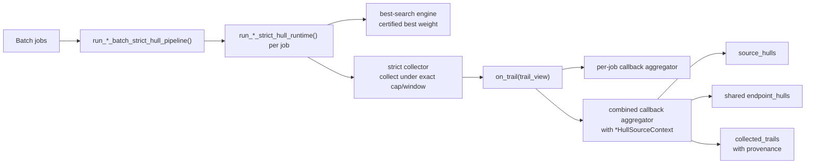
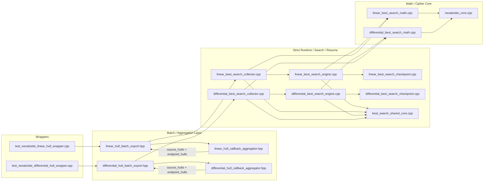

# NeoAlzette Auto Search Framework: Differential and Linear Architecture

This document describes the `auto_search_frame` module decomposition, the mapping between mathematical objects and implementation, the checkpoint / resume semantics for DFS, and the role of the `w-pDDT` and `Weight-Sliced cLAT` accelerators.

---

## 0. Paper Lineage and Method Source

The implementation inherits the following elements directly from the relevant ARX automatic-search literature:

- the mathematical objects,
- the search skeleton,
- the intermediate candidate-generation strategy,

- Differential side: follows the Biryukov / Velichkov pDDT, threshold-search, Matsui branch-and-bound line. The original pDDT is threshold-based:
  `DP(alpha,beta->gamma) >= p_thres`
  while this project keeps the same search spirit but upgrades the threshold axis into exact integer-weight shells:
  `S_t(alpha,beta) = { gamma | w_diff(alpha,beta->gamma) = t }`.
  The corresponding implementation name is `Weight-Sliced pDDT`.
- Linear side: follows Schulte-Geers style explicit modular-addition correlation formulas, plus the Huang / Wang 2019 route of specific-correlation-weight spaces, improved cLAT, and split-lookup-recombine. Mathematically the weight axis is the z-shell:
  `z = M^T(u xor v xor w)`, weighted by `wt(z)`.
- The explicit-stack DFS, checkpoint-resume skeleton, and candidate organization inside `auto_search_frame` belong to the same paper lineage; the implementation follows the same methodological line rather than only reusing terminology.

---

## 1. File Map

The large implementation is split by responsibility.

| Layer | Differential | Linear | Shared / Notes |
|------|--------------|--------|----------------|
| Types and context | `include/auto_search_frame/detail/differential_best_search_types.hpp` | `include/auto_search_frame/detail/linear_best_search_types.hpp` | |
| Primitives / enumerator state | `detail/differential_best_search_primitives.hpp` | `detail/linear_best_search_primitives.hpp` | |
| Math: weights, injections, add/sub-const, accelerators | `detail/differential_best_search_math.hpp` + `src/.../differential_best_search_math.cpp` | `detail/linear_best_search_math.hpp` + `src/.../linear_best_search_math.cpp` | |
| Search engine (explicit-stack DFS + Matsui-style pruning) | `src/auto_search_frame/differential_best_search_engine.cpp` | `src/auto_search_frame/linear_best_search_engine.cpp` | `detail/best_search_shared_core.hpp` + `best_search_shared_core.cpp` |
| Hull collector | implementation: `differential_best_search_collector.cpp` | implementation: `linear_best_search_collector.cpp` | public entry declarations still live in `detail/*_best_search_types.hpp`; callback helpers are in `differential_hull_callback_aggregator.hpp` / `linear_hull_callback_aggregator.hpp` |
| Binary checkpoint serialization | `detail/differential_best_search_checkpoint.hpp` + `differential_best_search_checkpoint.cpp` | `detail/linear_best_search_checkpoint.hpp` + `linear_best_search_checkpoint.cpp` | `search_checkpoint.hpp` defines magic, version, endian tag |
| Cipher ground truth | | | `include/neoalzette/neoalzette_core.hpp`, `src/neoalzette/neoalzette_core.cpp` |

The high-level test / wrapper entry points still appear in `include/auto_search_frame/test_neoalzette_*_best_search.hpp` and the `test_neoalzette_*.cpp` files.

### 1.1 Physical Repository Tree (Architecture-Relevant Source Paths Only)

The tree below shows the real source-of-truth paths behind the architecture. Directories such as `.vs/`, `build*/`, `out/`, `papers/`, `papers_txt/`, and `MyNewPaper/` exist in the repository, but are not part of the main `auto_search_frame` runtime source chain.

```text
.
|-- CMakeLists.txt
|-- common/
|   |-- runtime_component.hpp
|   `-- runtime_component.cpp
|-- include/
|   |-- neoalzette/
|   |   `-- neoalzette_core.hpp
|   |-- arx_analysis_operators/
|   |   |-- README.md
|   |   |-- differential_xdp_add.hpp
|   |   |-- differential_optimal_gamma.hpp
|   |   |-- differential_addconst.hpp
|   |   |-- linear_correlation_add_logn.hpp
|   |   |-- linear_correlation_addconst.hpp
|   |   |-- linear_correlation_addconst_flat.hpp
|   |   `-- modular_addition_ccz.hpp
|   `-- auto_search_frame/
|       |-- differential_batch_breadth_deep.hpp
|       |-- differential_hull_batch_export.hpp
|       |-- differential_hull_callback_aggregator.hpp
|       |-- hull_growth_common.hpp
|       |-- linear_batch_breadth_deep.hpp
|       |-- linear_hull_batch_export.hpp
|       |-- linear_hull_callback_aggregator.hpp
|       |-- search_checkpoint.hpp
|       |-- test_neoalzette_differential_best_search.hpp
|       |-- test_neoalzette_linear_best_search.hpp
|       `-- detail/
|           |-- auto_pipeline_shared.hpp
|           |-- best_search_shared_core.hpp
|           |-- differential_best_search_checkpoint.hpp
|           |-- differential_best_search_checkpoint_state.hpp
|           |-- differential_best_search_math.hpp
|           |-- differential_best_search_primitives.hpp
|           |-- differential_best_search_types.hpp
|           |-- linear_best_search_checkpoint.hpp
|           |-- linear_best_search_checkpoint_state.hpp
|           |-- linear_best_search_math.hpp
|           |-- linear_best_search_primitives.hpp
|           `-- linear_best_search_types.hpp
|-- src/
|   |-- neoalzette/
|   |   `-- neoalzette_core.cpp
|   `-- auto_search_frame/
|       |-- best_search_shared_core.cpp
|       |-- differential_best_search_checkpoint.cpp
|       |-- differential_best_search_collector.cpp
|       |-- differential_best_search_engine.cpp
|       |-- differential_best_search_math.cpp
|       |-- linear_best_search_checkpoint.cpp
|       |-- linear_best_search_collector.cpp
|       |-- linear_best_search_engine.cpp
|       `-- linear_best_search_math.cpp
|-- test_arx_operator_self_test.cpp
|-- test_neoalzette_arx_trace.cpp
|-- test_neoalzette_differential_best_search.cpp
|-- test_neoalzette_linear_best_search.cpp
|-- test_neoalzette_differential_hull_wrapper.cpp
|-- test_neoalzette_linear_hull_wrapper.cpp
|-- pnb_distinguisher/
|   |-- test_neoalzette_arx_probabilistic_neutral_bits.cpp
|   `-- test_neoalzette_arx_probabilistic_neutral_bits_average.cpp
`-- ...
```

### 1.2 Folder-to-Layer Correspondence

| Repository path | Role in the architecture | Key files |
|------|----------------|----------|
| `common/` | Shared CLI runtime support: memory gating, worker monitoring, log helpers | `runtime_component.hpp/.cpp` |
| `include/neoalzette/` + `src/neoalzette/` | Cipher ground-truth implementation | `neoalzette_core.hpp/.cpp` |
| `include/arx_analysis_operators/` | Header-only ARX math operator library | `differential_xdp_add.hpp`, `linear_correlation_addconst.hpp`, etc. |
| `include/auto_search_frame/` | Public facade, batch/hull export layer, wrapper-facing interfaces | `*_hull_batch_export.hpp`, `*_callback_aggregator.hpp`, `test_neoalzette_*_best_search.hpp` |
| `include/auto_search_frame/detail/` | Real internal state, checkpoint layouts, math declarations, enumerator primitives | `*_types.hpp`, `*_primitives.hpp`, `*_math.hpp`, `*_checkpoint*.hpp` |
| `src/auto_search_frame/` | Internal implementation: shared core / math / engine / collector / checkpoint | `best_search_shared_core.cpp`, `*_best_search_*.cpp` |
| Top-level `test_neoalzette_*_best_search.cpp` | Differential / linear best-search CLI entry programs in the top-level source directory | the two `*_best_search.cpp` files |
| Top-level `test_neoalzette_*_hull_wrapper.cpp` | Strict hull batch wrapper CLIs | the two `*_hull_wrapper.cpp` files |
| Top-level `test_neoalzette_arx_trace.cpp` | Trace / instrumentation entry | `test_neoalzette_arx_trace.cpp` |
| Top-level `test_arx_operator_self_test.cpp` | Shared self-test source reused by the best-search CLIs, not a standalone target | `run_arx_operator_self_test()` |
| `papers/`, `papers_txt/`, `MyNewPaper/` | Paper assets, experiments, writing materials | not part of the runtime core architecture |
| `.vs/`, `build*/`, `out/` | IDE / CMake / build-output directories | not part of the source layer |

### 1.3 Reverse-Mapping from `CMakeLists.txt`: Which Files Each Target Actually Builds

| CMake target | Entry file | Major source set | Meaning |
|-------------|----------|--------------|------|
| `neoalzette` | - | `src/neoalzette/neoalzette_core.cpp` | cipher-core static library |
| `test_neoalzette_arx_trace` | `test_neoalzette_arx_trace.cpp` | `neoalzette` | differential trace / instrumentation tool |
| `test_neoalzette_differential_best_search` | `test_neoalzette_differential_best_search.cpp` | `test_arx_operator_self_test.cpp`, `common/runtime_component.cpp`, `src/auto_search_frame/best_search_shared_core.cpp`, `src/auto_search_frame/differential_best_search_math.cpp`, `src/auto_search_frame/differential_best_search_checkpoint.cpp`, `src/auto_search_frame/differential_best_search_engine.cpp`, `src/auto_search_frame/differential_best_search_collector.cpp`, and currently also `src/auto_search_frame/linear_best_search_math.cpp` in CMake | differential best-search CLI |
| `test_neoalzette_linear_best_search` | `test_neoalzette_linear_best_search.cpp` | `test_arx_operator_self_test.cpp`, `common/runtime_component.cpp`, `src/auto_search_frame/best_search_shared_core.cpp`, `src/auto_search_frame/linear_best_search_math.cpp`, `src/auto_search_frame/linear_best_search_checkpoint.cpp`, `src/auto_search_frame/linear_best_search_engine.cpp`, `src/auto_search_frame/linear_best_search_collector.cpp`, and currently also `src/auto_search_frame/differential_best_search_math.cpp` in CMake | linear best-search CLI |
| `test_neoalzette_differential_hull_wrapper` | `test_neoalzette_differential_hull_wrapper.cpp` | `common/runtime_component.cpp` + full differential `src/auto_search_frame/*.cpp` set + `best_search_shared_core.cpp` | differential strict hull wrapper |
| `test_neoalzette_linear_hull_wrapper` | `test_neoalzette_linear_hull_wrapper.cpp` | `common/runtime_component.cpp` + full linear `src/auto_search_frame/*.cpp` set + `best_search_shared_core.cpp` | linear strict hull wrapper |
| `pnb_distinguisher/test_neoalzette_arx_probabilistic_neutral_bits` | `pnb_distinguisher/test_neoalzette_arx_probabilistic_neutral_bits.cpp` | `neoalzette_core` (subproject) | standalone PNB-style experiment program |
| `pnb_distinguisher/test_neoalzette_arx_probabilistic_neutral_bits_average` | `pnb_distinguisher/test_neoalzette_arx_probabilistic_neutral_bits_average.cpp` | `neoalzette_core` (subproject) | standalone average-PNB experiment program |

This table maps abstract architecture labels to the corresponding targets, entry files, and implementation file sets in `CMakeLists.txt`.

### 1.4 More Detailed Mermaid: From Repository Root to Executable Chain

The graph below no longer shows only abstract layers. It also shows the real repository root, the key folders, the top-level entry files, and the main `.cpp/.hpp` entities.

```mermaid
flowchart TB
    ROOT["repo root"]
    AUX["papers/ + MyNewPaper/ + build*/ + out/\n(non-runtime source folders or generated artifacts)"]

    ROOT --> CMAKE["CMakeLists.txt"]
    ROOT --> COMMON["common/runtime_component.*"]
    ROOT --> CORE_H["include/neoalzette/neoalzette_core.hpp"]
    ROOT --> OPS["include/arx_analysis_operators/*.hpp"]
    ROOT --> ASF_PUB["include/auto_search_frame/*.hpp"]
    ROOT --> ASF_DETAIL["include/auto_search_frame/detail/*.hpp"]
    ROOT --> CORE_CPP["src/neoalzette/neoalzette_core.cpp"]
    ROOT --> AUTO_SRC["src/auto_search_frame/*.cpp"]
    ROOT --> AUX

    CMAKE --> LIB["target: neoalzette"]
    CMAKE --> TRACE_T["target: test_neoalzette_arx_trace"]
    CMAKE --> DCLI_T["target: test_neoalzette_differential_best_search"]
    CMAKE --> LCLI_T["target: test_neoalzette_linear_best_search"]
    CMAKE --> DHULL_T["target: test_neoalzette_differential_hull_wrapper"]
    CMAKE --> LHULL_T["target: test_neoalzette_linear_hull_wrapper"]

    LIB --> CORE_CPP
    CORE_CPP --> CORE_H

    TRACE_T --> TRACE_MAIN["test_neoalzette_arx_trace.cpp"]
    TRACE_MAIN --> CORE_H

    DCLI_T --> DCLI_MAIN["test_neoalzette_differential_best_search.cpp"]
    DCLI_T --> SELFTEST["test_arx_operator_self_test.cpp"]
    DCLI_T --> COMMON
    DCLI_T --> D_SHARED["src/auto_search_frame/best_search_shared_core.cpp"]
    DCLI_T --> D_MATH["src/auto_search_frame/differential_best_search_math.cpp"]
    DCLI_T --> D_CKPT["src/auto_search_frame/differential_best_search_checkpoint.cpp"]
    DCLI_T --> D_ENGINE["src/auto_search_frame/differential_best_search_engine.cpp"]
    DCLI_T --> D_COLLECT["src/auto_search_frame/differential_best_search_collector.cpp"]
    DCLI_T --> D_API["include/auto_search_frame/test_neoalzette_differential_best_search.hpp"]

    LCLI_T --> LCLI_MAIN["test_neoalzette_linear_best_search.cpp"]
    LCLI_T --> SELFTEST
    LCLI_T --> COMMON
    LCLI_T --> L_SHARED["src/auto_search_frame/best_search_shared_core.cpp"]
    LCLI_T --> L_MATH["src/auto_search_frame/linear_best_search_math.cpp"]
    LCLI_T --> L_CKPT["src/auto_search_frame/linear_best_search_checkpoint.cpp"]
    LCLI_T --> L_ENGINE["src/auto_search_frame/linear_best_search_engine.cpp"]
    LCLI_T --> L_COLLECT["src/auto_search_frame/linear_best_search_collector.cpp"]
    LCLI_T --> L_API["include/auto_search_frame/test_neoalzette_linear_best_search.hpp"]

    DHULL_T --> DHULL_MAIN["test_neoalzette_differential_hull_wrapper.cpp"]
    DHULL_T --> COMMON
    DHULL_T --> D_ENGINE
    DHULL_T --> D_COLLECT
    DHULL_T --> D_API
    DHULL_T --> D_BATCH["include/auto_search_frame/differential_hull_batch_export.hpp"]
    DHULL_T --> D_AGG["include/auto_search_frame/differential_hull_callback_aggregator.hpp"]

    LHULL_T --> LHULL_MAIN["test_neoalzette_linear_hull_wrapper.cpp"]
    LHULL_T --> COMMON
    LHULL_T --> L_ENGINE
    LHULL_T --> L_COLLECT
    LHULL_T --> L_API
    LHULL_T --> L_BATCH["include/auto_search_frame/linear_hull_batch_export.hpp"]
    LHULL_T --> L_AGG["include/auto_search_frame/linear_hull_callback_aggregator.hpp"]

    D_API --> D_DETAIL["include/auto_search_frame/detail/differential_*.hpp"]
    L_API --> L_DETAIL["include/auto_search_frame/detail/linear_*.hpp"]
    D_ENGINE --> CORE_H
    D_COLLECT --> CORE_H
    L_ENGINE --> CORE_H
    L_COLLECT --> CORE_H
    D_MATH --> OPS
    L_MATH --> OPS
```



---

## 2. Differential Search

### 2.1 Mathematical Objects

- Each round carries 32-bit XOR differences `Delta A`, `Delta B`.
- The nonlinearity comes primarily from modular addition. The weight model is the usual `-log2(probability)` weight, aligned with LM2001 `xdp_add`.
- Variable-constant subtraction uses an exact model (`diff_subconst_exact_weight_ceil_int` and related exact APIs).
- The injection layers are modeled as affine output-difference spaces:
  `InjectionAffineTransition { offset, basis_vectors, rank_weight }`.
- The search runs forwards: from round-input different to round-output different.

### 2.2 Traversal Structure

`DifferentialBestTrailSearcherCursor` in `differential_best_search_engine.cpp` implements an explicit-stack DFS. The stage order is:

- `Enter`
- first modular addition
- first sub-const
- injection B -> A
- second modular addition
- second sub-const
- injection A -> B

The traversal order is DFS, but the pruning is Matsui-style branch-and-bound using the current global best weight.

### 2.3 Function-Level Math Wiring

The main math connection points inside `differential_best_search_engine.cpp` are:

- `prepare_round_state()`
  builds `rotl(A,31) xor rotl(A,17)` and calls `find_optimal_gamma_with_weight()` to obtain the exact LM2001 best possible weight for the first modular addition.
- `ModularAdditionEnumerator`
  enumerates the exact modular-addition shell under the current cap. This is the place where w-pDDT may accelerate the shell construction.
- `SubConstEnumerator`
  performs exact variable-constant subtraction enumeration.
- `compute_injection_transition_from_branch_b()` /
  `compute_injection_transition_from_branch_a()`
  derive the exact affine transition of each quadratic injection layer.
- `AffineSubspaceEnumerator`
  enumerates the concrete injection differences inside that affine space.

The engine file therefore serves as the integration point between the NeoAlzette round structure and the exact ARX analysis operators.

---

## 3. Linear Search

### 3.1 Mathematical Objects

- The state is tracked with linear masks over `F_2^32`.
- Weight is `-log2 |correlation|`.
- Modular addition uses Schulte-Geers style explicit correlation constraints, with weight determined by the z-shell.
- The search runs backwards: from round-output masks to round-input masks.
- The injection layers are modeled as affine input-mask spaces.

### 3.2 Traversal Structure

`LinearBestTrailSearcherCursor` in `linear_best_search_engine.cpp` also uses an explicit stack. It supports:

- direct stage-by-stage DFS, and
- an optional "enumerate full round predecessors first, then recurse" mode via `maximum_round_predecessors`.

This organization still follows the Huang / Wang style candidate structure: exact z-shell candidates plus split-lookup-recombine engineering.

### 3.3 Function-Level Math Wiring

The main linear connection points are:

- `compute_injection_transition_from_branch_a()` /
  `compute_injection_transition_from_branch_b()`
  compute the exact affine input-mask space induced by the quadratic injection.
- `enumerate_affine_subspace_input_masks()` and `LinearAffineMaskEnumerator`
  traverse that affine injection-mask space.
- `generate_subconst_candidates_for_fixed_beta()` and `SubConstStreamingCursor`
  generate exact variable-constant candidates.
- `AddVarVarSplit8Enumerator32::get_candidates_for_output_mask_u()`,
  `AddVarVarSplit8Enumerator32::StreamingCursor`, and
  `WeightSlicedClatStreamingCursor`
  are three engineering paths for the same mathematical object: exact modular-addition z-shell candidates under the Schulte-Geers / Huang-Wang model.

The engine file is likewise the integration point between the search framework and the concrete ARX mathematics, rather than an isolated control shell.

---

## 4. Collector vs Engine

The relationship is summarized as follows.

- `*_best_search_engine.cpp` is the resumable best-trail search engine.
  It keeps an explicit cursor and supports binary checkpoint / resume.
- `*_best_search_collector.cpp` is a single-run hull collector.
  It enumerates and aggregates all trails within a weight cap, but it does not maintain a resumable DFS cursor and does not implement binary checkpoint / resume.
- They are not conflicting duplicate engines.
  They reuse the same mathematical objects for different goals.
- `run_*_strict_hull_runtime()` explicitly composes them:
  1. run the best-search engine to obtain a best-weight reference,
  2. run the collector to aggregate the hull within the selected window.

That best-weight reference now has two user-facing certification layers:

- `exact_best_certified`
  means the engine finished without non-strict caps, hard limits, or target shortcuts.
- `threshold_target_certified`
  means the engine hit `target_best_weight` under otherwise strict local settings, so the threshold statement is certified even though exact-best completion is not claimed.

So this is a composition pipeline, not "one resumable searcher plus a hidden non-resumable replacement".

---

## 5. DFS vs Branch-and-Bound

The implementation is:

- DFS in traversal order and storage discipline,
- Matsui-style branch-and-bound in pruning logic.

These are not contradictory.

The engine maintains a global incumbent (`best_total_weight` / `best_weight`). A subtree is pruned when:

- partial accumulated weight,
- plus a valid lower bound for the remaining rounds,

cannot beat the incumbent.

This is the standard ARX trail-search engineering choice: DFS for memory behavior, branch-and-bound for correctness-preserving pruning.

---

## 6. What "Strict" Means

Strictness needs to be separated into three layers:

### 6.1 Model Strictness

- Differential modular addition: LM2001.
- Linear modular addition: Schulte-Geers constraints and z-weight.
- Variable-constant subtraction: exact carry-state style enumeration.
- Injection: exact affine transition models.

### 6.2 Search Strictness

- Memoization only prunes states when the recorded bound is safe.
- Remaining-round lower bounds are safe only when a valid global lower bound is available.
- Branch caps and heuristic candidate caps can make the search non-strict.

### 6.3 Certification Surface

`StrictCertificationFailureReason` records why a run should not be claimed `exact_best_certified`, such as:

- branch caps,
- non-strict remaining-round bounds,
- target-best-weight shortcuts,
- resume checkpoint mismatch,
- checkpoint load failure.

---

## 7. Checkpoint / Resume

### 7.1 What Is Serialized

The binary checkpoint stores the full resumable DFS state, including:

- configuration and starting point,
- best trail and current in-progress trail,
- full `cursor.stack`,
- per-frame round state,
- per-frame enumerator state,
- memoization,
- runtime counters and control metadata.

Writeout is atomic.

### 7.2 Resume Semantics

`run_differential_best_search_resume()` and `run_linear_best_search_resume()`:

1. read the checkpoint,
2. verify starting point and configuration compatibility,
3. restore best trail, current trail, cursor, counters, and memoization,
4. continue DFS from the restored cursor.

The resume path restores the DFS state rather than merely reloading the current best result.

### 7.3 Accelerator State and Strict Same-Node Resume

For strict same-node resume semantics, every in-flight accelerator state that affects:

- the next candidate,
- the next branch order,
- the current cursor position,

should be serialized.

But that does **not** mean "serialize every global cache in the program".

- Linear side:
  the checkpoint already stores the in-flight cLAT / SLR state at the right granularity:
  `WeightSlicedClatStreamingCursor`,
  `AddVarVarSplit8Enumerator32::StreamingCursor`,
  `SubConstStreamingCursor`,
  materialized candidate vectors,
  and the current indices.
- Differential side:
  the checkpoint already stores the modular-addition enumerator stack, shell index, target weight, and related cursor metadata.
  However, the local `ModularAdditionEnumerator::shell_cache` contents are currently rebuilt rather than serialized.
- Global w-pDDT cache:
  `WeightSlicedPddtCache` is still treated as rebuildable accelerator cache and is intentionally not serialized as a giant global table.

The engineering consequences are:

- if the criterion is "same mathematical result", the current differential design is acceptable because cache misses fall back to exact shell reconstruction;
- if the criterion is "same interrupted node with no trust in rebuild code", the differential side should serialize the **local in-flight modular-addition shell contents**, not the whole global pDDT cache.

---

## 8. w-pDDT

`Weight-Sliced pDDT` is the differential modular-addition accelerator.

- It stores exact weight shells:
  `S_t(alpha,beta) = { gamma | w_diff(alpha,beta->gamma) = t }`.
- It inherits the pDDT / threshold-search lineage, but replaces threshold slices by exact weight shells.
- It is rebuildable accelerator state only.
  It must never define truth.
- Disabling it or missing the cache must not change the mathematical result, only performance.

---

## 9. Weight-Sliced cLAT

`Weight-Sliced cLAT` on the linear side should be understood precisely as:

- mathematical object: exact z-shell candidates under a fixed output mask,
- engineering realization: cLAT-style split-lookup-recombine / streaming enumeration.

It is not a full classical cLAT table dumped to disk.

In strict mode, candidate-count caps must be disabled. The checkpoint stores the in-flight cursor state of this streaming path.

---

## 10. One-Sentence Summary

Both the differential and linear pipelines are:

`NeoAlzetteCore` round structure
-> exact ARX math objects in `*_math`
-> explicit-stack Matsui-style search in `*_engine`
-> serialized cursor / memoization in `*_checkpoint`

while the hull collectors are separate single-run aggregation layers built on top of the same math, not competing checkpoint engines.

---

## Appendix A. Batch Best-Search to Endpoint Strict Hull

The batch pipeline relevant to endpoint-level paper claims is:

1. the wrapper (`test_neoalzette_*_hull_wrapper.cpp`) parses a batch job list and builds `*BatchHullPipelineOptions`;
2. `run_*_batch_strict_hull_pipeline()` in `include/auto_search_frame/*_hull_batch_export.hpp` runs one `run_*_strict_hull_runtime()` per job;
3. inside each strict runtime, `src/auto_search_frame/*_best_search_collector.cpp` first runs the resumable best-search engine to obtain a certified best weight, then runs the exact collector under either an explicit cap or a best-weight-plus-window cap;
4. every collected trail is fanned out through `on_trail` to both:
   - the per-job callback aggregator, and
   - a combined callback aggregator tagged with `*HullSourceContext`;
5. `include/auto_search_frame/*_hull_callback_aggregator.hpp` then keeps three views at once:
   - `source_hulls`: strict per-source hull buckets,
   - `endpoint_hulls`: merged endpoint hull buckets across all sources,
   - `collected_trails`: optional stored trails with source provenance;
6. the truth-bearing batch object is therefore the in-memory `combined_source_hull.callback_aggregator`, not the CSV layer.

This pipeline represents the most conservative endpoint-hull reporting path currently exposed by the codebase: each source job is still collected under its own strict cap, while the final paper-facing hull is stated at the shared endpoint level with source decomposition retained for audit, attribution, and post-analysis. A stricter formulation remains possible in principle, but would impose noticeably higher complexity and runtime cost for limited practical gain.

### Appendix A.1 Batch Checkpoint / Resume Contract

The current wrapper-level batch pipeline is no longer one-shot only. It now has two explicit checkpoint kinds:

1. `DifferentialHullBatchSelection` / `LinearHullBatchSelection`
   - stores the **source-selection stage** state before strict hull collection.
   - payload includes:
     - batch jobs,
     - completed breadth-job flags,
     - accumulated breadth node counts,
     - current `top_candidates`,
     - selection stage marker:
       - `selection_breadth`,
       - `selection_deep_ready`.
2. `DifferentialHullBatch` / `LinearHullBatch`
   - stores the **selected-source strict-hull stage** state.
   - payload includes:
     - selected jobs,
     - per-job strict-hull summaries,
     - completed strict-hull job flags,
     - combined callback aggregator:
       - `source_hulls`,
       - `endpoint_hulls`,
       - optional stored trails.

Resume semantics are intentionally conservative:

- batch resume is at **stage/job boundary**,
- not at arbitrary same-node DFS position inside an in-flight batch job,
- while the embedded single-run best-search engine still keeps its own binary checkpoint / resume semantics.

In practice this means:

- an interrupted **selection** run resumes from the last persisted breadth/deep-ready stage object;
- an interrupted **strict-hull** batch resumes from the last completed strict-hull job;
- an in-flight job may be recomputed from its job boundary after resume.

### Appendix A.2 Wrapper Runtime Event Stream

The wrapper-level batch audit stream is written by `--batch-runtime-log PATH`.

The canonical events are:

- `batch_start`
  - emitted when the wrapper batch invocation begins.
  - records checkpoint/runtime-log paths and resume intent.
- `batch_resume_start`
  - emitted after loading a batch checkpoint.
  - records:
    - `checkpoint_kind`,
    - `stage`,
    - `batch_resume_fingerprint_hash`,
    - `batch_resume_fingerprint_completed_jobs`,
    - `batch_resume_fingerprint_payload_count`,
    - `batch_resume_fingerprint_payload_digest`,
    - and, for strict-hull checkpoints,
      `batch_resume_fingerprint_source_hull_count`,
      `batch_resume_fingerprint_endpoint_hull_count`,
      `batch_resume_fingerprint_collected_trail_count`.
- `batch_checkpoint_write`
  - emitted after every successful wrapper-level batch checkpoint write.
  - records:
    - `checkpoint_kind`,
    - `checkpoint_reason`,
    - `checkpoint_path`,
    - the same `batch_resume_fingerprint_*` fields.
- `batch_stop`
  - emitted when the wrapper batch invocation finishes.
  - records final job counts, selected-source counts, and the final strict-hull fingerprint when available.

Current checkpoint reasons are intentionally descriptive and stage-local:

- selection stage:
  - `selection_stage_init`,
  - `breadth_job_completed`,
  - `selection_deep_ready`;
- strict-hull stage:
  - `strict_hull_stage_init`,
  - `strict_hull_job_completed`.

This event stream is designed so QA can verify resumed batch continuity by matching:

- latest successful `batch_checkpoint_write`,
- subsequent `batch_resume_start`,
- and the shared `batch_resume_fingerprint_hash`.

### Appendix A.3 Audit Interpretation

For paper-facing endpoint claims, the object that carries truth is still:

- the in-memory combined callback aggregator during execution, and
- its checkpointed counterpart after resume,

not merely:

- console summaries,
- CSV exports,
- or the currently-best single trail.

The wrapper runtime log should therefore be interpreted as the **audit trail of the batch object**, not as the batch object itself.

### Appendix A.4 Wrapper-Side Accelerator Knobs

The wrapper CLIs now expose the same accelerator knobs that matter for paper-facing batch runs.

- Differential hull wrapper:
  - `--enable-pddt`
  - `--disable-pddt`
  - `--pddt-max-weight W`
- Linear hull wrapper:
  - `--enable-z-shell`
  - `--disable-z-shell`
  - `--z-shell-max-candidates N`

Their semantics are intentionally asymmetric:

- `Weight-Sliced pDDT` on the differential side is still a **strict cache-only accelerator**.
  - It only controls whether exact modular-addition weight shells are cached and how deep the cache is allowed to go.
  - Cache miss still rebuilds the exact shell.
  - Therefore:
    - enabling/disabling pDDT,
    - or changing `--pddt-max-weight`,
    changes RAM usage and performance,
    but should not change the mathematical result.
- `Weight-Sliced cLAT` / z-shell streaming on the linear side can be configured from both best-search and hull-wrapper CLIs, but:
  - any nonzero candidate cap is a truncating helper setting,
  - and the strict linear hull wrapper forces that cap back to `0`.

So the practical wrapper contract is:

- differential hull wrapper may expose tunable pDDT cache depth because pDDT itself is strict;
- linear hull wrapper may expose z-shell knobs for operator selection / experimentation,
  but the final strict-hull path still enforces non-truncating semantics.



## Appendix B. Mermaid C++ File Architecture Graph

## Architecture Layers and File Paths

### 1. Wrappers Layer
- `test_neoalzette_linear_hull_wrapper.cpp`  
  Path: `test_neoalzette_linear_hull_wrapper.cpp` (top‑level test directory, no additional prefix in the original diagram)
- `test_neoalzette_differential_hull_wrapper.cpp`  
  Path: `test_neoalzette_differential_hull_wrapper.cpp`

### 2. Batch / Aggregation Layer
- `linear_hull_batch_export.hpp`  
  Path: `include/auto_search_frame/linear_hull_batch_export.hpp`
- `differential_hull_batch_export.hpp`  
  Path: `include/auto_search_frame/differential_hull_batch_export.hpp`
- `linear_hull_callback_aggregator.hpp`  
  Path: `include/auto_search_frame/linear_hull_callback_aggregator.hpp`
- `differential_hull_callback_aggregator.hpp`  
  Path: `include/auto_search_frame/differential_hull_callback_aggregator.hpp`

### 3. Strict Runtime / Search / Resume Layer
- `linear_best_search_collector.cpp`  
  Path: `src/auto_search_frame/linear_best_search_collector.cpp`
- `differential_best_search_collector.cpp`  
  Path: `src/auto_search_frame/differential_best_search_collector.cpp`
- `linear_best_search_engine.cpp`  
  Path: `src/auto_search_frame/linear_best_search_engine.cpp`
- `differential_best_search_engine.cpp`  
  Path: `src/auto_search_frame/differential_best_search_engine.cpp`
- `linear_best_search_checkpoint.cpp`  
  Path: `src/auto_search_frame/linear_best_search_checkpoint.cpp`
- `differential_best_search_checkpoint.cpp`  
  Path: `src/auto_search_frame/differential_best_search_checkpoint.cpp`
- `best_search_shared_core.cpp`  
  Path: `src/auto_search_frame/best_search_shared_core.cpp`

### 4. Math / Cipher Core Layer
- `linear_best_search_math.cpp`  
  Path: `src/auto_search_frame/linear_best_search_math.cpp`
- `differential_best_search_math.cpp`  
  Path: `src/auto_search_frame/differential_best_search_math.cpp`
- `neoalzette_core.cpp`  
  Path: `src/neoalzette/neoalzette_core.cpp`

---

## Simplified Dependency Diagram (Filenames Only)

The graph is about responsibility and runtime/data flow, not literal `#include` edges.


